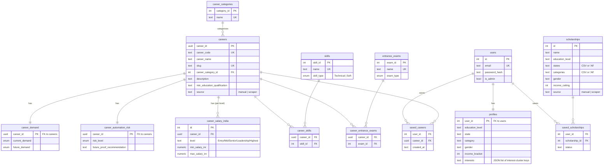

# PathWise India (MVP)

[](LICENSE)
[](https://github.com/developeranurag-stack/pathwise/actions/workflows/ci.yml)

Discover your future. Find the funding to reach it.

Open-source career and scholarship guidance for Indian students. The app covers
profile + interest quiz, a career explorer (search, compare, verified vs
placeholder data), education path and exam calendar, scholarship matching with
reasons, government job notifications, a save/checklist roadmap, and a
Hindi-first assistant. Payments and school/counselor dashboards are out of
scope.

## Stack

Flask + Postgres, server-rendered Jinja templates, Tailwind via CDN. No
frontend build step.

## Database schema

`schema.sql` defines two things: a normalized ~25-table career database (careers plus lookup/junction
tables for skills, exams, salary bands, demand, automation risk, etc.), and the app's own tables
(users, profiles, scholarships, saved items). Route code and templates never join the normalized
career tables directly — they read through `career_app_view`, which flattens everything into one row
per career (skills/exams aggregated via `string_agg`). The diagram below covers the tables that are
actually wired into the app today:



`career_app_view` (not shown as a table above — it's a `SELECT` over `careers` LEFT JOINed to
`career_categories`, `career_demand`, `career_salary_india` (`level = 'Entry Level (0-3 Yrs)'`), and
`career_automation_risk`, with skills/exams aggregated via correlated subqueries) is what
`career_category.name` doubles as: the onboarding interest-cluster key (`tech`, `business`, `law`, ...)
consumed by `recommended_career_ids()`.

`sources` (scraper config: name, URL, parser) isn't a real foreign key relationship — it's linked to
`careers`/`scholarships` only loosely, by convention, via the `source` text column (`'scraper:<source
name>'`) so re-scraping a source only overwrites rows it previously wrote, never manually-entered ones.

`schema.sql` also defines ~25 more normalized tables (`industries`, `streams`, `degrees`,
`career_work_life_balance`, `career_remote_work`, `riasec_types`, `mbti_types`, `core_strengths`,
`subjects`, `recruiters`, `certifications`, `career_internships`, `learning_resources`, `countries`,
`career_advantages`, `career_challenges`, `career_roadmap_steps`, `comparison_metrics`,
`growth_drivers`, `employment_opportunity_types`, `career_progression_roles`,
`career_related_industries`, `career_international_opportunities`, and their junction tables) plus a
`career_summary` view. These exist for a richer future career-explorer/compare experience but aren't
read by any current route or template — omitted above to keep the diagram legible.

## Run locally

Python 3.11+ and Postgres are required.

```bash
git clone https://github.com/developeranurag-stack/pathwise.git
cd pathwise
python -m venv venv
source venv/bin/activate          # Windows: venv\Scripts\activate
pip install -r requirements.txt
cp .env.example .env
```

Start a local Postgres with Docker (user/password/db are all `pathwise`):

```bash
docker compose up -d
```

Or point `DATABASE_URL` in `.env` at any Postgres instance (Neon works). Set a
real `SECRET_KEY`. `OPENROUTER_API_KEY` is optional and only needed for
`/assistant`.

```bash
python main.py
```

Visit http://127.0.0.1:5000. Schema (`schema.sql`) and seed data (careers,
scholarships) are created automatically on first run against an empty database.

Government-job PDF ingestion is optional and lives in the sibling
[pathwise-mcp](https://github.com/developeranurag-stack/pathwise-mcp) project.
Copy `.mcp.json.example` to `.mcp.json` if you run that MCP server locally.

## Demo user (staging)

Run `python create_demo_user.py` after the database exists (or it will create one)
to set up a demo account with a filled-in profile and a few saved careers/scholarships.

To completely wipe + re-initialize the DB (e.g. after editing `schema.sql`):
```
python clear_db.py
```
(DB is cleared and re-seeded immediately; then you can start the server.)

- Email: `demo@pathwise.in`
- Password: `demo1234`

Re-running the script resets the password and refreshes the demo profile/saved
items — safe to run on every staging deploy.

## What's implemented

- Auth: register / login / logout (session-based, hashed passwords)
- Onboarding: education, stream, board, marks, state, category, gender, income,
  disability/minority/rural flags, subjects, interests
- RIASEC interest quiz (12 questions) used in career ranking
- Career explorer: search, sort, 50+ editorially verified careers (plus
  placeholder titles behind a toggle), compare 2–3 careers, institutes,
  year-by-year path, related careers / exams / scholarships
- Scholarship finder: search, match reasons (why / why not), application status
- Government jobs: search and filters (open vs historical, commission, state),
  save to roadmap, eligibility notes
- Exam calendar for JEE, NEET, CUET, CLAT, UPSC, SSC, NDA, and others
- Dashboard: next steps, deadlines, document checklist, parent share link
- Assistant: Hindi-first tool-using chat, persisted history, save/profile tools
- English / Hindi UI toggle

## Not yet built

Resume/essay review, email/WhatsApp reminder delivery, premium billing,
school/counselor (B2B) dashboards, a full college database.

Scholarship data is illustrative for demo purposes — verify current eligibility
and deadlines on official portals before applying.

## Tests

```bash
pip install pytest
python -m pytest tests/ -q
```

No database is required for the test suite.

## Contributing

Bug reports, data corrections with citations, and small patches are welcome.
See [CONTRIBUTING.md](CONTRIBUTING.md) and the [Code of Conduct](CODE_OF_CONDUCT.md).
Please report vulnerabilities privately as described in [SECURITY.md](SECURITY.md).

## License

[MIT](LICENSE) © 2026 Anurag Prem Soni
