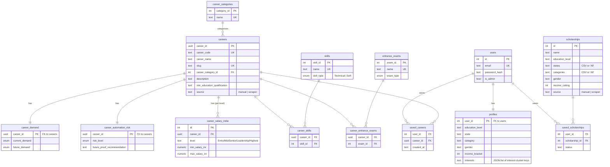

# PathWise India (MVP)

Discover your future. Find the funding to reach it.

An MVP covering the core PathWise journey: profile-based career recommendations
(Step 1-2) and scholarship matching with a save/roadmap dashboard (Step 4-5).
Education-path details are folded into each career page (Step 3). AI chat
features, payments, and B2B dashboards are out of scope for this MVP.

## Stack

Flask + Postgres (Neon), server-rendered Jinja templates, Tailwind via CDN.

## Database schema

`schema.sql` defines two things: a normalized ~25-table career database (careers plus lookup/junction
tables for skills, exams, salary bands, demand, automation risk, etc.), and the app's own tables
(users, profiles, scholarships, saved items). Route code and templates never join the normalized
career tables directly — they read through `career_app_view`, which flattens everything into one row
per career (skills/exams aggregated via `string_agg`). The diagram below covers the tables that are
actually wired into the app today:



`career_app_view` (not shown as a table above — it's a `SELECT` over `careers` LEFT JOINed to
`career_categories`, `career_demand`, `career_salary_india` (`level = 'Entry Level (0-3 Yrs)'`), and
`career_automation_risk`, with skills/exams aggregated via correlated subqueries) is what
`career_category.name` doubles as: the onboarding interest-cluster key (`tech`, `business`, `law`, ...)
consumed by `recommended_career_ids()`.

`sources` (scraper config: name, URL, parser) isn't a real foreign key relationship — it's linked to
`careers`/`scholarships` only loosely, by convention, via the `source` text column (`'scraper:<source
name>'`) so re-scraping a source only overwrites rows it previously wrote, never manually-entered ones.

`schema.sql` also defines ~25 more normalized tables (`industries`, `streams`, `degrees`,
`career_work_life_balance`, `career_remote_work`, `riasec_types`, `mbti_types`, `core_strengths`,
`subjects`, `recruiters`, `certifications`, `career_internships`, `learning_resources`, `countries`,
`career_advantages`, `career_challenges`, `career_roadmap_steps`, `comparison_metrics`,
`growth_drivers`, `employment_opportunity_types`, `career_progression_roles`,
`career_related_industries`, `career_international_opportunities`, and their junction tables) plus a
`career_summary` view. These exist for a richer future career-explorer/compare experience but aren't
read by any current route or template — omitted above to keep the diagram legible.

## Run locally

```
python -m venv venv
./venv/Scripts/pip install -r requirements.txt   # venv/bin/pip on macOS/Linux
```

Copy `.env.example` to `.env` and fill in `DATABASE_URL` with your Postgres connection string
(e.g. a Neon connection string).

```
./venv/Scripts/python main.py                     # venv/bin/python on macOS/Linux
```

Visit http://127.0.0.1:5000. The schema (`schema.sql`) and seed data (careers, scholarships)
are created automatically on first run against an empty database, from `seed_data.py`.

## Demo user (staging)

Run `python create_demo_user.py` after the database exists (or it will create one)
to set up a demo account with a filled-in profile and a few saved careers/scholarships.

To completely wipe + re-initialize the DB (e.g. after editing `schema.sql`):
```
python clear_db.py
```
(DB is cleared and re-seeded immediately; then you can start the server.)

- Email: `demo@pathwise.in`
- Password: `demo1234`

Re-running the script resets the password and refreshes the demo profile/saved
items — safe to run on every staging deploy.

## What's implemented

- Auth: register / login / logout (session-based, hashed passwords)
- Onboarding quiz: education level, state, category, gender, income, interests
- Career explorer: browse/filter by interest cluster, detail pages with salary,
  demand, skills, AI impact, education path, exams
- Scholarship finder: browse/filter by type, eligibility matching against the
  student's profile (education level, state, category, gender, income ceiling)
- Dashboard/roadmap: saved careers & scholarships, deadline visibility,
  personalized recommendations

## Not yet built

AI chat assistant, resume/essay review, application checklist/document tracking,
reminders, premium billing, school/counselor (B2B) dashboards.

Scholarship data is illustrative for demo purposes — verify current eligibility
and deadlines on official portals before applying.
